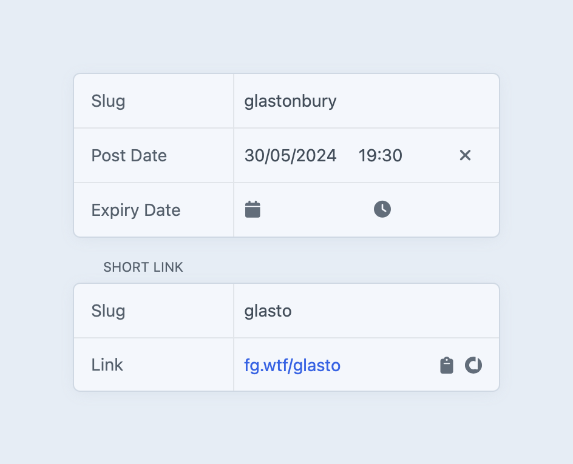

# Dub

Create Dub short links for your entries.

## Requirements

- A [Dub](https://refer.dub.co/bensomething) account (affiliate link) and API key. [Learn more.](https://dub.co/docs/api-reference/authentication#api-keys)
- Craft CMS 5.0.0 or later.
- PHP 8.2 or later.

## Installation

```
composer require bensomething/craft-dub
```

Then install the plugin via the Craft control panel under **Settings → Plugins**, or from the terminal:

```
php craft plugin/install dub
```

## Configuration

1. Go to **Settings → Plugins → Dub** in the Craft control panel.
2. Enter your Dub API key. You can use an environment variable (e.g. `$DUB_API_KEY`).
3. After saving your API key, the **Domain** section will display a dropdown of your available domains.

## Usage

Once configured, a **Short Link** panel will appear in the sidebar of any entry that belongs to a section with URLs.

- **Creating a short link:** enter a custom slug in the **Short Link** sidebar section and save the entry. If left blank, no short link is created.
- **Updating a short link:** update the short link slug in the sidebar and save. The existing Dub link is updated in place.
- **Deleting a short link:** a short link will be removed from Dub when an entry is deleted or when a short link slug is removed and the entry is saved.
- **Archiving a short link:** a short link will be archived in Dub when an entry is disabled.



[](https://packagist.org/packages/bensomething/craft-dub)
[](https://packagist.org/packages/bensomething/craft-dub)