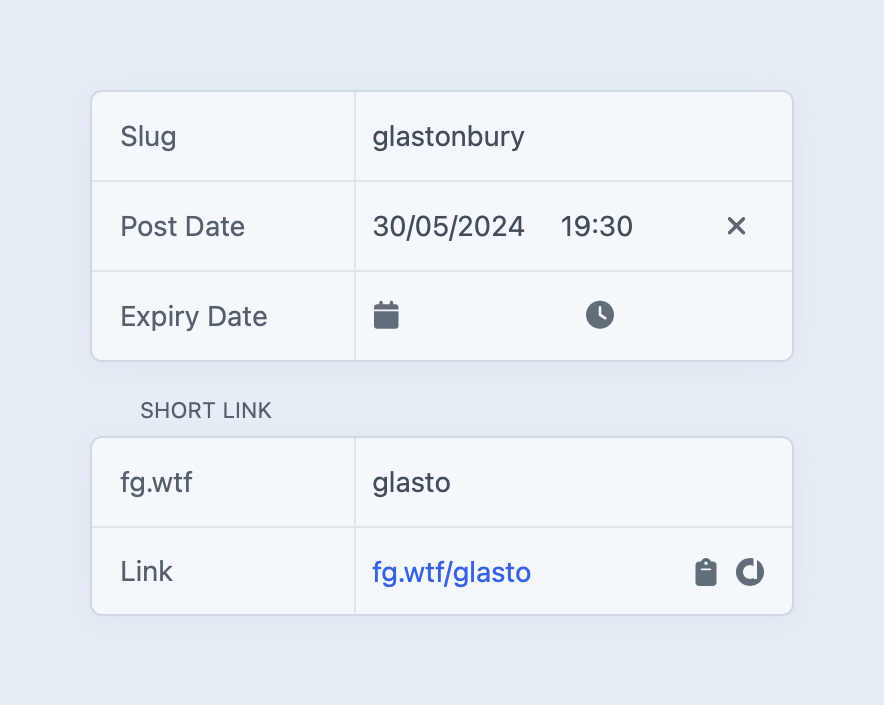

# Dub

Create Dub short links for your entries.

## Requirements

- A [Dub](https://refer.dub.co/bensomething) account (affiliate link) and API key. [Learn more.](https://dub.co/docs/api-reference/authentication#api-keys)
- Craft CMS 5.0.0 or later.
- PHP 8.2 or later.

## Installation

To install the plugin, search for "Dub" in the Craft Plugin Store, or install manually using composer.

```
composer require bensomething/craft-dub
```

Then install the plugin via the Craft control panel under **Settings → Plugins**, or from the terminal:

```
php craft plugin/install dub
```

## Configuration

1. Go to **Settings → Plugins → Dub** in the Craft control panel.
2. Enter your Dub API key. You can use an environment variable (e.g. `$DUB_API_KEY`).
3. After saving your API key, the **Domain** field will suggest your available domains. Pick one, or use an environment variable (e.g. `$DUB_DOMAIN`).
4. In the **Sections** field, choose which sections to enable short links for. Leave **All** selected to enable every section that has URLs.

### Setting enabled sections via environment

You can override the **Sections** selection with the `DUB_SECTIONS` environment variable — a comma-separated list of section **handles**:

```
DUB_SECTIONS=festivals,crew
```

When set, it takes precedence over the control panel selection (which is shown as read-only in the settings).

## Usage

Once configured, a **Short Link** panel will appear in the sidebar of any entry that belongs to a section with URLs.

- **Creating a short link:** enter a custom slug in the **Short Link** sidebar section and save the entry. If left blank, no short link is created.
- **Updating a short link:** update the short link slug in the sidebar and save. The existing Dub link is updated in place.
- **Deleting a short link:** a short link will be removed from Dub when an entry is deleted or when a short link slug is removed and the entry is saved.
- **Archiving a short link:** a short link will be archived in Dub when an entry is disabled.

## Adopting existing links

If your Dub workspace already contains short links for your entries — created manually or before installing the plugin — you can hand them over to the plugin in one pass:

```
php craft dub/adopt
```

This scans your workspace, matches each link to a Craft entry by the path of its destination URL, sets the entry's `externalId` on the link so the plugin manages it going forward, and records it locally. Links with no matching entry (or a path shared by more than one site) are left untouched.

Add `--dry-run` to preview what would be adopted without making any changes:

```
php craft dub/adopt --dry-run
```

If some of your Dub links point to an old path prefix, use `--rewrite` to remap the destination path when matching. It only applies as a fallback, when the link's original path matches no entry. Pass one or more comma-separated `from=to` prefixes:

```
php craft dub/adopt --rewrite="/areas-stages/=/venues/"
```

## Templating

Use the `dubLink(entry)` Twig function to output a short link in your templates:

```twig


    <a href="{{ shortLink }}">{{ shortLink }}</a>

```



[](https://packagist.org/packages/bensomething/craft-dub)
[](https://packagist.org/packages/bensomething/craft-dub)